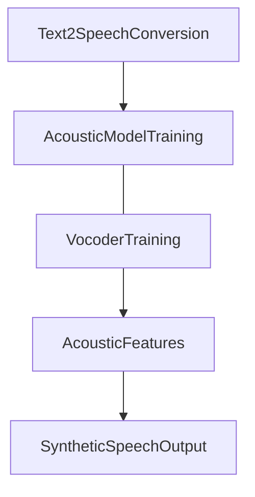

# Voice Cloning using coqui-TTS

## Finetuned [coqui-TTS](https://github.com/coqui-ai/TTS)

Voice cloning is the process of converting text input into natural and expressive synthetic speech using a pre-trained Text-to-Speech (TTS) model. In this project, we utilized the coqui-TTS model, which involves two main stages: Text and Audio Preprocessing and Acoustic Model Training. The text data undergoes tokenization and normalization, while the audio data is converted into Mel-frequency cepstral coefficients (MFCCs) or spectrograms. The acoustic model, typically implemented using neural networks like RNNs or transformers, learns the mapping between text representations and acoustic features. Finally, the vocoder synthesizes the acoustic features into high-quality waveforms, generating the desired speech output.


## Dataset Preparation:


For this project, we used a dataset consisting of 82 data points of Priyanka Chopra's voice notes and their corresponding transcriptions. The dataset was meticulously prepared in the following steps:

* Extracted voice and subtitles from **Priyanka Chopra's** interview using [yt-dlp](https://github.com/yt-dlp/yt-dlp).
* Filtered the data to remove voices of other speakers from both audio and text data.
* Converted the subtitles to plain and clean text using an [online tool](https://subtitletools.com/convert-subtitles-to-plain-text-online).
* Cleaned the audio dataset using [Audacity](https://www.audacityteam.org/download/) to enhance its usability.
* Organized the dataset by creating a .csv file containing the audio file paths and corresponding dialogues.


#### Dataset Structure:
```
/converted
 | - data-01.wav
 | - data-01.wav
 | - data-01.wav

/metadata.csv

  | - data-01|Dialogue 1.
  | - data-02|Dialogue 2.
  | - data-03|Dialogue 3.

```

## HyperParameters And Pretrained Model Weights:

To achieve the best results, we fine-tuned the coqui-TTS model using the following set of hyperparameters:

| HyperParameters Used
|--------------------------
| batch_size=1,
| eval_batch_size=1,
| num_loader_workers=4,
| num_eval_loader_workers=4,
| run_eval=True,
| test_delay_epochs=-1,
| epochs=100,
| text_cleaner="phoneme_cleaners",
| use_phonemes=True,
| phoneme_language="en-us",
| mixed_precision=True,
| save_step=1000,


## Results:

The following results were obtained by finetuning coqui-TTS model.

|  Average Loss |     Average Log MLE(Maximum Likelihood Estimation)               |        Average Loader Time |     
| ------------- | -------------                        | -------------           |
|    0.3985443115234375     |    -0.3307391405105591                            |    0.5410037040710449               |


## Use Trained Model from Commad line

To use the trained model from the command line, you can follow the example command provided below:

```
 !tts --text "Hi, I am an excellent Text to Speech cloning AI" \
      --model_path $model.pth\
      --config_path $comfig.json \
      --out_path out.wav
  import IPython
  IPython.display.Audio("out.wav")
```

## Feedback

If you have any feedback, please reach out to me at: [](https://linkedin.com/in/anuj-sahani-34363725b) 

Author: [@anujsahani01](https://github.com/anujsahani01)

